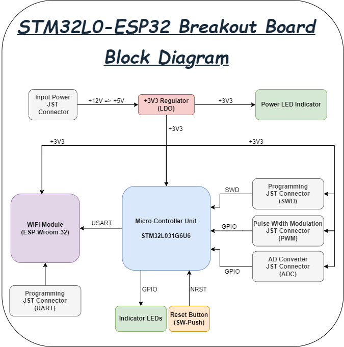
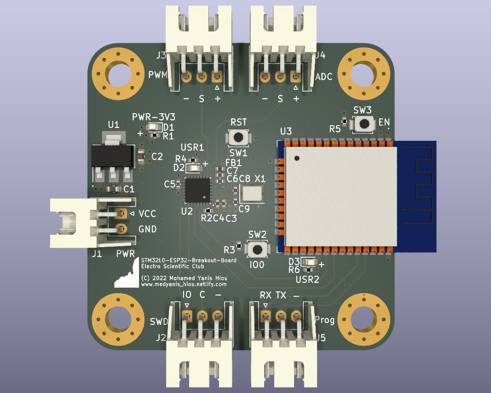
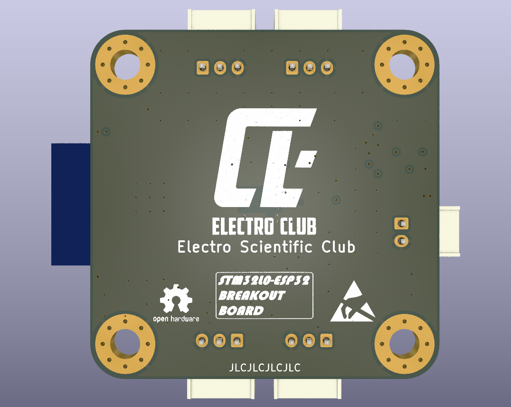
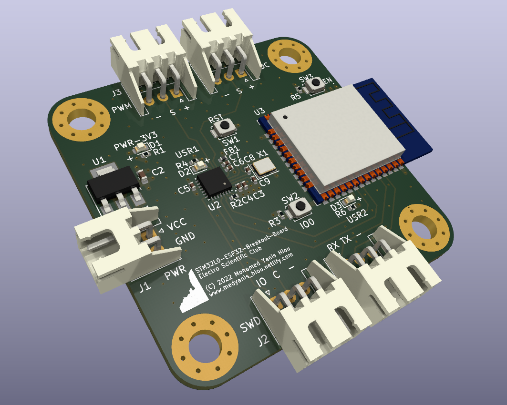
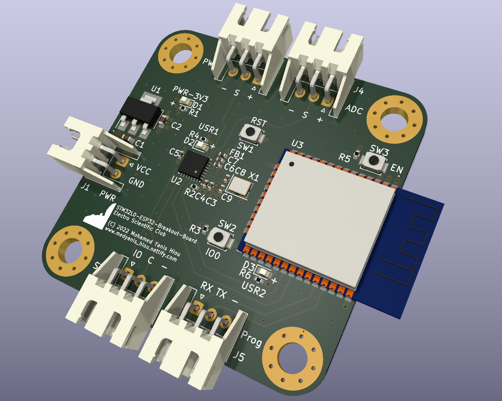
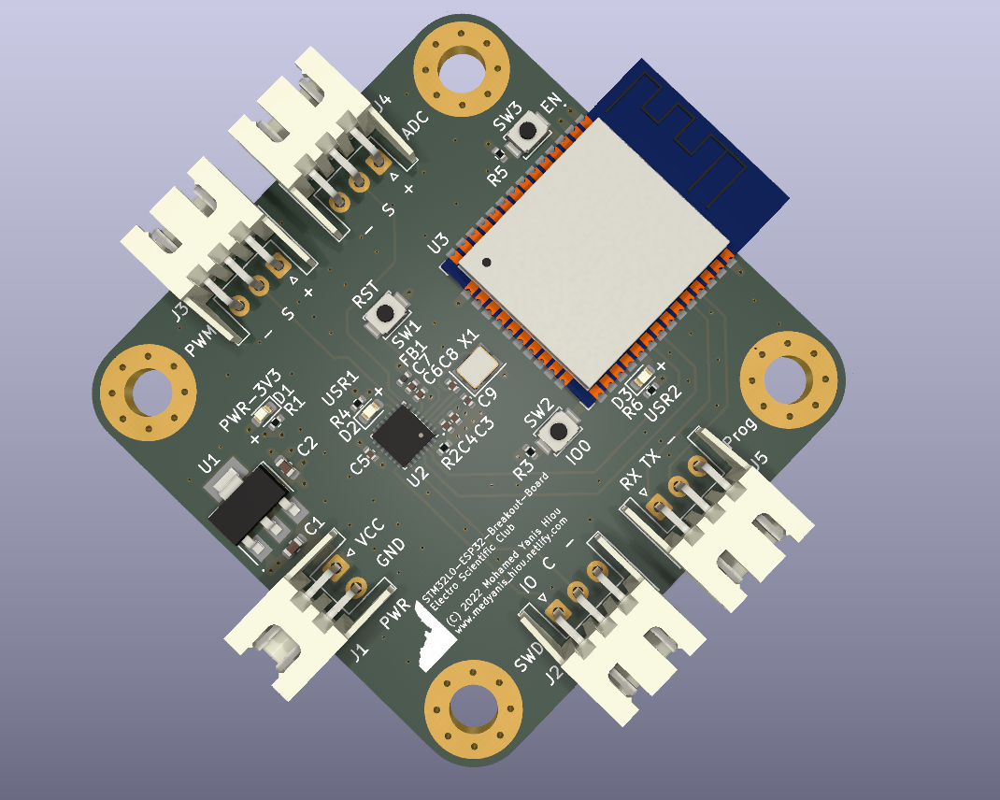
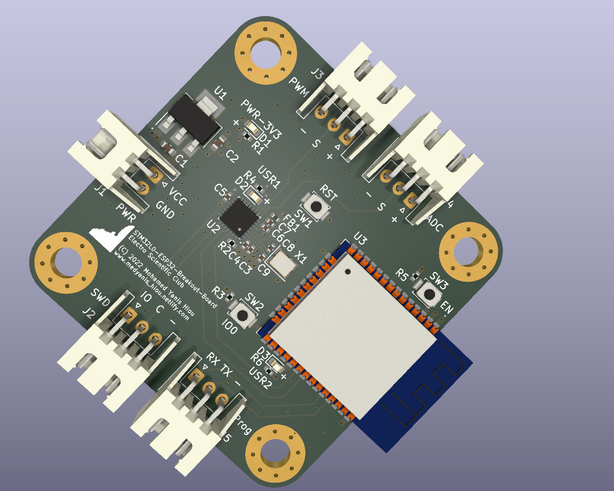

# STM32L0-ESP32 Breakout Board
[](LICENSE)


This is a small breakout Printed Circuit Board (PCB) that is based on the STM32 microcontroller as well as the ESP32 dev module.
The PCB is designed using the free and open source software <a href="https://github.com/KiCad">KiCad</a>. 

## More Details
The PCB is based on the STM32L0 series, specificaly the STM32L031G6U6 microcontroller which is a low power based MCU. The MCU is operated with a High Speed Internal (HSI) clock signal of a 16 MHz crystal oscillator.<br><br>
It's operating with an input voltage from 12V to 5V. The input voltage will be filtered and reduced to 3V3 in order to power the STM32 MCU as well as the ESP32 module.<br><br>
The purpose of this PCB is to control the temperature with a PID controller. It has two connectors for that, one for reading temperature value with a thermostat, a thermocouple, or a temperature IC (LM36/LM35) that gives an analog signal, and the other connector is used to control the temperature using a Solid State Relay (SSR) controlled by a PWM signal.<br><br>
The data read from the STM32 MCU is transmitted to the ESP32 dev module via 'USART' protocol in order to send the data to the cloud and the temperature could be controlled wirelessly anywhere with a smart phone or a web application.<br><br>
STM32 MCU can be flashed using SWD programmer and the ESP32 dev module could be programmed using a USB-to-TTL converter.<br><br>


## Features :dart:
* [x] Four layers PCB
* [x] Low power
* [x] Small size
* [x] Very easy to use

## Thank _You_!
Please :star: this repo to help us improve the quality.
<br><br>

## PCB Block Diagram
PCB System Block
:---------------------:



## 3D Viewer
Front View           | Back View
:---------------------:|:------------------:
 | 
Side View 1         |  Side View 2
 | 
Side View 3         |  Side View 4
 | 


## Requirements

If you want to review the PCB or yoou wanna edit the schematics/layout, yoou only need to install KiCad software to your machine.

* Go to the <a href="https://www.kicad.org/download/">Official KiCad Download Page</a>.
* Select your operating system.
* Download the executable file and install it.

## Documentations
Open the [Datasheets](Datasheets) folder and you will find all the datasheets, applications notes, and design guidelines that help you understand the design better.


## How To Use It

1. Install this repository, click <a href="https://github.com/mohamedyanis/STM32L0-ESP32-Breakout-Board/archive/master.zip"> here </a> to install it. Or use git command:
```bach
git clone https://github.com/mohamedyanis/STM32L0-ESP32-Breakout-Board.git
```
3. Extract the folder and open it.
4. Navigate for the [Manufacturing](Manufacturing) folder.
5. Go to your best PCB manufacturer website and click on quote.
6. Upload the [STM32L0-ESP32-Breakout-Board-Gerber.rar](Manufacturing/Gerber/STM32L0-ESP32-Breakout-Board-Gerber.rar) in order to order the board.
7. In case you want to receive it assembled, upload the [STM32L0_ESP32_Breakout_Board_BOM.csv](Manufacturing/Assembly/STM32L0_ESP32_Breakout_Board_BOM.csv) and [STM32L0_ESP32_Breakout_Board_Components_Positions.csv](Manufacturing/Assembly/STM32L0_ESP32_Breakout_Board_Components_Positions.csv) files.

## Contributing 💡
If you want to contribute to this project and make it better with new ideas, your pull request is very welcomed.<br>
If you find any issue just put it in the repository issue section, thanks!<br><br>
.سبحَانَكَ اللَّهُمَّ وَبِحَمْدِكَ، أَشْهَدُ أَنْ لا إِلهَ إِلأَ انْتَ أَسْتَغْفِرُكَ وَأَتْوبُ إِلَيْكَ
